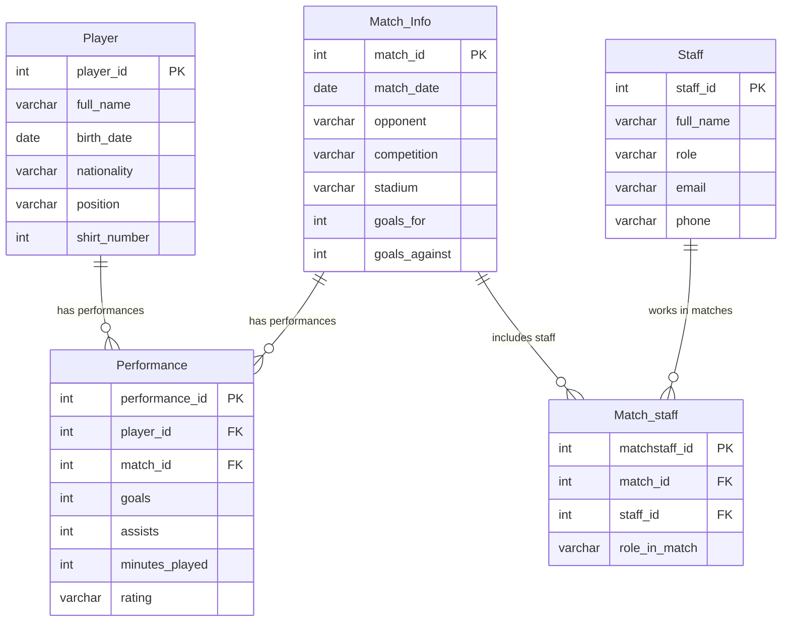
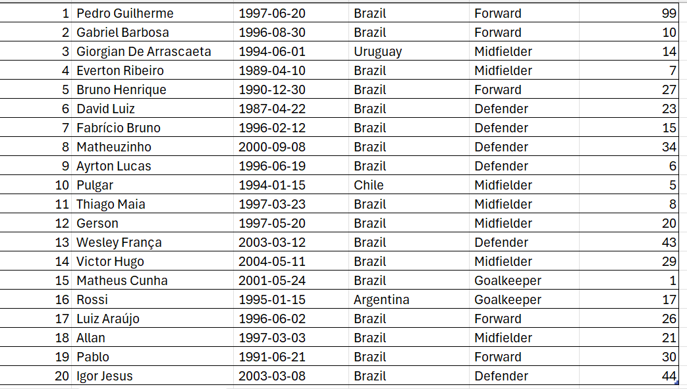

# Flamengo FC Professional Team Database 

## Business Description:  
Flamengo FC, officially known as Clube de Regatas do Flamengo, is one of Brazil’s most popular and successful football clubs, based in Rio de Janeiro. The organization manages hundreds of players across different age categories, multiple competitions per season, and a massive base of fans and staff members. 
This database is designed to support the club’s internal operations, focusing on player management, match scheduling, and performance tracking. It will help staff easily store, retrieve, and analyze essential information such as player statistics, match outcomes, training sessions, and team performance indicators. 

### User’s Perspective: 
From a user’s perspective, this system can be used by coaches, analysts, and administrative staff. Coaches can view players’ stats, track goals or assists per match, and monitor fitness updates. Analysts can generate performance reports per player or per match to identify trends and make data-driven decisions. Administrative staff can register players, schedule upcoming matches, and maintain match histories — all from a single relational database. 
The system ensures data accuracy, quick access to information, and easy reporting — reducing the amount of manual work currently done in spreadsheets or paper records.

---

## Database ER Model


### Database Design Description
The Flamengo FC Professional Team database was designed to efficiently store and organize information related to players, staff members, matches, and performance statistics. The goal was to create a relational structure that mirrors how a real professional soccer club manages its operational data while maintaining simplicity and full normalization. The core of the design focuses on two main entities — Player and MatchInfo — and a Performance table that records the many-to-many relationship between them, since players participate in multiple matches and each match includes multiple players. This separation ensures that performance statistics are not duplicated and can be analyzed cleanly. 
During the normalization process, all tables were brought to Third Normal Form (3NF). This required separating staff information into its own table and creating a junction table, MatchStaff, to represent the many-to-many relationship between matches and staff members. Without a linking table, staff involvement in matches would either be partially represented or create unnecessary duplication. By isolating attributes into their appropriate tables and ensuring that each non-key attribute depends solely on its table's primary key, the database avoids update, insertion, and deletion anomalies. 
Another key design decision was ensuring flexibility. This database could easily expand to include additional Flamengo squads (U20, U17), training sessions, contracts, or injury tracking without major restructuring. The design also includes indexes on frequently queried fields (such as player positions and staff roles), improving query performance. Overall, the model balances clarity, normalization, and real-world usability while supporting complex SQL queries required by the project.

`Player Table` 
stores the essential biographical and professional information for each Flamengo professional player, including name, nationality, position, and shirt number. It serves as the foundation for tracking individual player participation in matches. All player-specific statistics are recorded separately in the Performance table. 

`MatchInfo Table`
records all official games Flamengo plays, including the opponent, competition, stadium, date, and final score. It functions as the central reference point for connecting performance data and staff participation. Each match can involve multiple players and multiple staff members. 

`Performance Table` 
represents the many-to-many relationship between players and matches, storing detailed in-game statistics such as goals, assists, minutes played, and match rating. This structure allows for robust statistical analysis of individual player performance across different competitions. Each record refers uniquely to a player-match combination. 

`Staff Table`
stores information about coaches, assistants, medical personnel, and analysts who work directly with the Flamengo professional squad. It keeps track of their names, roles, and contact information. Since staff may participate in multiple matches, their match involvement is tracked separately. 

`MatchStaff Table` 
connects staff members to the matches they participated in, serving as a junction table to model their many-to-many relationship with matches. It also records the specific role the staff member served in that match (e.g., Head Coach, Physio). This enables detailed analysis of match preparation and staffing patterns. 

---

### Create Tables
The following SQL creates the `Player`, `MatchInfo`, `Performance`,`Staff` and `MatchStaff` tables in the database. Note that it does not create a database, only the tables.

```sql

-- =========================================================
-- PLAYER TABLE
-- Stores all registered team players
-- =========================================================

CREATE TABLE Player (
    player_id     INT PRIMARY KEY AUTO_INCREMENT,
    full_name     VARCHAR(100) NOT NULL,
    birth_date    DATE NOT NULL,
    nationality   VARCHAR(50),
    position      VARCHAR(30) NOT NULL,
    shirt_number  INT UNIQUE,

    INDEX idx_position (position)
)ENGINE=InnoDB;


-- =========================================================
-- MATCH INFO TABLE
-- Stores all match details
-- =========================================================

CREATE TABLE Match_Info (
    match_id        INT PRIMARY KEY AUTO_INCREMENT,
    match_date       DATE NOT NULL,
    opponent        VARCHAR(100) NOT NULL,
    competition     VARCHAR(100),
    stadium         VARCHAR(100),
    goals_for       INT DEFAULT 0,
    goals_against   INT DEFAULT 0
)ENGINE=InnoDB;


-- =========================================================
-- STAFF TABLE
-- Stores coaches, trainers, and support staff
-- =========================================================

CREATE TABLE Staff (
    staff_id   INT PRIMARY KEY AUTO_INCREMENT,
    full_name  VARCHAR(100) NOT NULL,
    role       VARCHAR(50) NOT NULL,
    email      VARCHAR(100),
    phone      VARCHAR(20),

    INDEX idx_role (role)
)ENGINE=InnoDB;


-- =========================================================
-- PERFORMANCE TABLE
-- Links players to matches and records their statistics
-- =========================================================

CREATE TABLE Performance (
    performance_id  INT PRIMARY KEY AUTO_INCREMENT,
    player_id        INT NOT NULL,
    match_id         INT NOT NULL,
    goals            INT DEFAULT 0,
    assists          INT DEFAULT 0,
    minutes_played   INT DEFAULT 0,
    rating           VARCHAR(10),

    FOREIGN KEY (player_id) 
        REFERENCES Player(player_id)
        ON DELETE CASCADE
        ON UPDATE CASCADE,

    FOREIGN KEY (match_id) 
        REFERENCES Match_Info(match_id)
        ON DELETE CASCADE
        ON UPDATE CASCADE,

    INDEX idx_player (player_id),
    INDEX idx_match (match_id)
)ENGINE=InnoDB;


-- =========================================================
-- MATCH_STAFF TABLE
-- Links staff members to specific matches
-- =========================================================

CREATE TABLE Match_Staff (
    matchstaff_id   INT PRIMARY KEY AUTO_INCREMENT,
    match_id         INT NOT NULL,
    staff_id         INT NOT NULL,
    role_in_match   VARCHAR(50),

    FOREIGN KEY (match_id) 
        REFERENCES Match_Info(match_id)
        ON DELETE CASCADE
        ON UPDATE CASCADE,

    FOREIGN KEY (staff_id) 
        REFERENCES Staff(staff_id)
        ON DELETE CASCADE
        ON UPDATE CASCADE,

    INDEX idx_matchstaff_match (match_id),
    INDEX idx_matchstaff_staff (staff_id)
)ENGINE=InnoDB;

```

---

### Insert Data
The following SQL inserts sample data for the `Player`, `Staff`, `Match_Info`, `Match_Staff` and `Performance` tables in the current database.

```sql

-- Player SAMPLE DATA (20 rows)
INSERT INTO Player (full_name, birth_date, nationality, position, shirt_number)
VALUES
('Pedro Guilherme', '1997-06-20', 'Brazil', 'Forward', 9),
('Gabriel Barbosa', '1996-08-30', 'Brazil', 'Forward', 10),
('Giorgian De Arrascaeta', '1994-06-01', 'Uruguay', 'Midfielder', 14),
('Everton Ribeiro', '1989-04-10', 'Brazil', 'Midfielder', 7),
('Bruno Henrique', '1990-12-30', 'Brazil', 'Forward', 27),
('David Luiz', '1987-04-22', 'Brazil', 'Defender', 23),
('Fabrício Bruno', '1996-02-12', 'Brazil', 'Defender', 15),
('Matheuzinho', '2000-09-08', 'Brazil', 'Defender', 34),
('Ayrton Lucas', '1996-06-19', 'Brazil', 'Defender', 6),
('Pulgar', '1994-01-15', 'Chile', 'Midfielder', 5),
('Thiago Maia', '1997-03-23', 'Brazil', 'Midfielder', 8),
('Gerson', '1997-05-20', 'Brazil', 'Midfielder', 20),
('Wesley França', '2003-03-12', 'Brazil', 'Defender', 43),
('Victor Hugo', '2004-05-11', 'Brazil', 'Midfielder', 29),
('Matheus Cunha', '2001-05-24', 'Brazil', 'Goalkeeper', 1),
('Rossi', '1995-01-15', 'Argentina', 'Goalkeeper', 17),
('Luiz Araújo', '1996-06-02', 'Brazil', 'Forward', 26),
('Allan', '1997-03-03', 'Brazil', 'Midfielder', 21),
('Pablo', '1991-06-21', 'Brazil', 'Forward', 30),
('Igor Jesus', '2003-03-08', 'Brazil', 'Defender', 44);

-- Staff SAMPLE DATA (20 rows)
INSERT INTO Staff (full_name, role, email, phone) VALUES
('Tite', 'Head Coach', 'tite@flamengo.com', '555-1010'),
('César Sampaio', 'Assistant Coach', 'sampaio@flamengo.com', '555-2020'),
('Claudio Maldonado', 'Assistant Coach', 'maldonado@flamengo.com', '555-3030'),
('Ramon Menezes', 'Technical Analyst', 'ramon@flamengo.com', '555-4040'),
('Flavio Meira', 'Fitness Coach', 'flavio@flamengo.com', '555-5050'),
('Marcos Braz', 'Team Director', 'mbraz@flamengo.com', '555-6060'),
('Dr. Márcio Tannure', 'Team Doctor', 'tannure@flamengo.com', '555-7070'),
('Alexandre Sanz', 'Physiotherapist', 'sanz@flamengo.com', '555-8080'),
('Juan', 'Team Manager', 'juan@flamengo.com', '555-9090'),
('Diego Ribas', 'Motivational Coach', 'diego@flamengo.com', '555-1111'),
('Paulo Sousa', 'Goalkeeper Coach', 'psousa@flamengo.com', '555-1212'),
('Gilberto Silva', 'Nutritionist', 'gsilva@flamengo.com', '555-1313'),
('Renato Gaúcho Jr', 'Video Analyst', 'rgjunior@flamengo.com', '555-1414'),
('Pedro Martins', 'Assistant Fitness Coach', 'pmartins@flamengo.com', '555-1515'),
('Fernando Azevedo', 'Scout', 'fazevedo@flamengo.com', '555-1616'),
('Rafael Costa', 'Youth Coordinator', 'rcosta@flamengo.com', '555-1717'),
('Leandro Alves', 'Press Officer', 'lalves@flamengo.com', '555-1818'),
('João Pedro', 'Logistics Manager', 'jpedro@flamengo.com', '555-1919'),
('Lucas Nogueira', 'Equipment Manager', 'lnogueira@flamengo.com', '555-2021'),
('Eduardo Lima', 'Medical Assistant', 'elima@flamengo.com', '555-2121');

-- Match_Info SAMPLE DATA (20 rows)
INSERT INTO Match_Info (match_date, opponent, competition, stadium, goals_for, goals_against)
VALUES
('2025-01-15', 'Vasco da Gama', 'Campeonato Carioca', 'Maracanã', 3, 1),
('2025-01-22', 'Botafogo', 'Campeonato Carioca', 'Nilton Santos', 2, 2),
('2025-02-01', 'Fluminense', 'Campeonato Carioca', 'Maracanã', 1, 0),
('2025-02-08', 'Palmeiras', 'Supercopa do Brasil', 'Mineirão', 2, 1),
('2025-02-15', 'São Paulo', 'Brasileirão', 'Morumbi', 1, 1),
('2025-02-22', 'Corinthians', 'Brasileirão', 'Maracanã', 4, 2),
('2025-03-01', 'Grêmio', 'Brasileirão', 'Arena do Grêmio', 0, 2),
('2025-03-08', 'Internacional', 'Brasileirão', 'Maracanã', 3, 0),
('2025-03-15', 'Atlético Mineiro', 'Brasileirão', 'Arena MRV', 2, 3),
('2025-03-22', 'Cuiabá', 'Brasileirão', 'Maracanã', 4, 1),
('2025-03-29', 'Cruzeiro', 'Brasileirão', 'Mineirão', 1, 2),
('2025-04-05', 'Fortaleza', 'Brasileirão', 'Maracanã', 2, 2),
('2025-04-12', 'Bahia', 'Brasileirão', 'Fonte Nova', 3, 1),
('2025-04-19', 'Athletico PR', 'Brasileirão', 'Maracanã', 2, 0),
('2025-04-26', 'Red Bull Bragantino', 'Brasileirão', 'Nabi Abi Chedid', 1, 1),
('2025-05-03', 'Santos', 'Brasileirão', 'Vila Belmiro', 2, 1),
('2025-05-10', 'Juventude', 'Brasileirão', 'Maracanã', 3, 0),
('2025-05-17', 'Botafogo', 'Brasileirão', 'Nilton Santos', 1, 1),
('2025-05-24', 'Coritiba', 'Brasileirão', 'Couto Pereira', 2, 2),
('2025-05-31', 'Fluminense', 'Brasileirão', 'Maracanã', 1, 0);

-- Match_Staff SAMPLE DATA (20 rows)
INSERT INTO Match_Staff (match_id, staff_id, role_in_match)
VALUES
(1, 1, 'Head Coach'),
(1, 2, 'Assistant'),
(1, 7, 'Doctor'),
(2, 1, 'Head Coach'),
(2, 3, 'Assistant'),
(3, 1, 'Head Coach'),
(3, 4, 'Analyst'),
(4, 1, 'Head Coach'),
(4, 5, 'Fitness Coach'),
(5, 1, 'Head Coach'),
(5, 2, 'Assistant'),
(6, 1, 'Head Coach'),
(6, 3, 'Assistant'),
(7, 1, 'Head Coach'),
(8, 1, 'Head Coach'),
(9, 1, 'Head Coach'),
(10, 1, 'Head Coach'),
(11, 1, 'Head Coach'),
(12, 1, 'Head Coach'),
(13, 1, 'Head Coach');

-------------------------------------------------------
-- Performance SAMPLE DATA (100 rows)
-------------------------------------------------------
INSERT INTO Performance (player_id, match_id, goals, assists, minutes_played, rating)
VALUES
(1, 1, 1, 0, 90, '7.5'),
(1, 2, 0, 1, 85, '7.0'),
(1, 3, 1, 0, 78, '8.0'),
(1, 4, 2, 0, 90, '8.5'),
(1, 5, 0, 0, 82, '6.5'),

(2, 1, 0, 1, 90, '7.0'),
(2, 2, 1, 0, 90, '7.5'),
(2, 3, 0, 0, 75, '6.5'),
(2, 4, 1, 1, 88, '8.0'),
(2, 5, 0, 0, 82, '6.0'),

(3, 1, 1, 1, 90, '8.5'),
(3, 2, 0, 2, 90, '8.0'),
(3, 3, 0, 1, 89, '7.5'),
(3, 4, 1, 0, 90, '7.8'),
(3, 5, 0, 0, 75, '6.5'),

(4, 1, 0, 1, 85, '7.0'),
(4, 2, 0, 0, 88, '6.5'),
(4, 3, 1, 0, 90, '7.8'),
(4, 4, 0, 1, 82, '7.0'),
(4, 5, 0, 0, 80, '6.0'),

(5, 1, 1, 0, 90, '7.2'),
(5, 2, 1, 1, 87, '8.0'),
(5, 3, 0, 0, 70, '6.0'),
(5, 4, 0, 1, 75, '6.8'),
(5, 5, 1, 0, 90, '7.5'),

(6, 1, 0, 0, 90, '6.8'),
(6, 2, 0, 0, 90, '6.5'),
(6, 3, 0, 0, 88, '6.0'),
(6, 4, 1, 0, 90, '7.2'),
(6, 5, 0, 0, 90, '6.3'),

(7, 1, 0, 0, 90, '6.7'),
(7, 2, 0, 0, 85, '6.5'),
(7, 3, 1, 0, 89, '7.2'),
(7, 4, 0, 0, 90, '6.8'),
(7, 5, 0, 0, 90, '6.4'),

(8, 1, 0, 0, 90, '6.6'),
(8, 2, 0, 1, 88, '7.0'),
(8, 3, 0, 0, 90, '6.5'),
(8, 4, 0, 0, 90, '6.8'),
(8, 5, 0, 0, 75, '6.0'),

(9, 1, 0, 0, 90, '6.4'),
(9, 2, 0, 0, 90, '6.6'),
(9, 3, 0, 0, 88, '6.3'),
(9, 4, 0, 0, 90, '6.7'),
(9, 5, 0, 0, 90, '6.5'),

(10, 1, 0, 1, 90, '7.0'),
(10, 2, 0, 0, 88, '6.5'),
(10, 3, 0, 0, 85, '6.2'),
(10, 4, 0, 0, 90, '6.4'),
(10, 5, 0, 0, 78, '6.1'),

-- Player 11–20
(11, 1, 0, 0, 80, '6.3'),
(11, 2, 0, 0, 85, '6.2'),
(11, 3, 0, 0, 90, '6.0'),
(11, 4, 0, 0, 87, '6.1'),
(11, 5, 0, 0, 90, '6.0'),

(12, 1, 1, 0, 90, '7.0'),
(12, 2, 0, 1, 90, '7.1'),
(12, 3, 1, 0, 88, '7.3'),
(12, 4, 0, 0, 90, '6.4'),
(12, 5, 0, 0, 80, '6.2'),

(13, 1, 0, 0, 90, '6.4'),
(13, 2, 0, 0, 90, '6.2'),
(13, 3, 0, 0, 85, '6.0'),
(13, 4, 1, 0, 90, '7.0'),
(13, 5, 0, 0, 90, '6.3'),

(14, 1, 0, 0, 90, '6.5'),
(14, 2, 0, 0, 88, '6.3'),
(14, 3, 0, 1, 87, '7.0'),
(14, 4, 0, 0, 90, '6.4'),
(14, 5, 0, 0, 90, '6.2'),

(15, 1, 0, 0, 90, '6.4'),
(15, 2, 0, 0, 90, '6.5'),
(15, 3, 0, 0, 88, '6.4'),
(15, 4, 0, 0, 90, '6.3'),
(15, 5, 0, 0, 90, '6.1'),

(16, 1, 0, 0, 90, '6.8'),
(16, 2, 0, 0, 85, '6.4'),
(16, 3, 0, 0, 90, '6.1'),
(16, 4, 0, 0, 90, '6.3'),
(16, 5, 0, 0, 90, '6.0'),

(17, 1, 1, 0, 90, '7.0'),
(17, 2, 0, 1, 87, '7.1'),
(17, 3, 0, 0, 90, '6.4'),
(17, 4, 0, 0, 90, '6.2'),
(17, 5, 0, 0, 90, '6.1'),

(18, 1, 0, 0, 90, '6.5'),
(18, 2, 0, 0, 85, '6.3'),
(18, 3, 0, 0, 82, '6.0'),
(18, 4, 0, 0, 88, '6.2'),
(18, 5, 0, 0, 90, '6.0'),

(19, 1, 0, 0, 87, '6.4'),
(19, 2, 0, 0, 90, '6.6'),
(19, 3, 0, 0, 90, '6.5'),
(19, 4, 0, 0, 89, '6.3'),
(19, 5, 0, 0, 90, '6.1'),

(20, 1, 0, 0, 78, '6.0'),
(20, 2, 0, 0, 82, '6.1'),
(20, 3, 0, 0, 80, '6.0'),
(20, 4, 0, 0, 88, '6.2'),
(20, 5, 0, 0, 90, '6.1');

```

---

### Queries

## Query 1
This query retrieves all players and orders them first by position and then by shirt_number. This type of sorting is useful when coaches want to see the roster organized by tactical roles and player jersey number order.
```sql
SELECT player_id, full_name, position, shirt_number
FROM Player
ORDER BY position, shirt_number;
```
**Sample Output**
```code
+-----------+------------------------+------------+--------------+
| player_id | full_name              | position   | shirt_number |
+-----------+------------------------+------------+--------------+
|         9 | Ayrton Lucas           | Defender   |            6 |
|         7 | Fabrício Bruno         | Defender   |           15 |
|         6 | David Luiz             | Defender   |           23 |
|         8 | Matheuzinho            | Defender   |           34 |
|        13 | Wesley França          | Defender   |           43 |
|        20 | Igor Jesus             | Defender   |           44 |
|         1 | Pedro Guilherme        | Forward    |            9 |
|         2 | Gabriel Barbosa        | Forward    |           10 |
|        17 | Luiz Araújo            | Forward    |           26 |
|         5 | Bruno Henrique         | Forward    |           27 |
|        19 | Pablo                  | Forward    |           30 |
|        15 | Matheus Cunha          | Goalkeeper |            1 |
|        16 | Rossi                  | Goalkeeper |           17 |
|        10 | Pulgar                 | Midfielder |            5 |
|         4 | Everton Ribeiro        | Midfielder |            7 |
|        11 | Thiago Maia            | Midfielder |            8 |
|         3 | Giorgian De Arrascaeta | Midfielder |           14 |
|        12 | Gerson                 | Midfielder |           20 |
|        18 | Allan                  | Midfielder |           21 |
|        14 | Victor Hugo            | Midfielder |           29 |
+-----------+------------------------+------------+--------------+
20 rows in set (0.001 sec)

```

---

## Query 2
This query calculates a player’s goal contribution per match by adding goals and assists. It is used to evaluate a player’s direct involvement in scoring actions.
```sql
SELECT P.full_name, F.goals, F.assists,
(F.goals + F.assists) AS total_contribution
FROM Performance F
JOIN Player P ON F.player_id = P.player_id;
```
**Sample Output**
```code
+------------------------+-------+---------+--------------------+
| full_name              | goals | assists | total_contribution |
+------------------------+-------+---------+--------------------+
| Pedro Guilherme        |     1 |       0 |                  1 |
| Pedro Guilherme        |     0 |       1 |                  1 |
| Pedro Guilherme        |     1 |       0 |                  1 |
| Pedro Guilherme        |     2 |       0 |                  2 |
| Pedro Guilherme        |     0 |       0 |                  0 |
| Gabriel Barbosa        |     0 |       1 |                  1 |
| Gabriel Barbosa        |     1 |       0 |                  1 |
| Gabriel Barbosa        |     0 |       0 |                  0 |
| Gabriel Barbosa        |     1 |       1 |                  2 |
| Gabriel Barbosa        |     0 |       0 |                  0 |
| Giorgian De Arrascaeta |     1 |       1 |                  2 |
| Giorgian De Arrascaeta |     0 |       2 |                  2 |
| Giorgian De Arrascaeta |     0 |       1 |                  1 |
| Giorgian De Arrascaeta |     1 |       0 |                  1 |
| Giorgian De Arrascaeta |     0 |       0 |                  0 |
| Everton Ribeiro        |     0 |       1 |                  1 |
| Everton Ribeiro        |     0 |       0 |                  0 |
| Everton Ribeiro        |     1 |       0 |                  1 |
| Everton Ribeiro        |     0 |       1 |                  1 |
| Everton Ribeiro        |     0 |       0 |                  0 |
| Bruno Henrique         |     1 |       0 |                  1 |
| Bruno Henrique         |     1 |       1 |                  2 |
| Bruno Henrique         |     0 |       0 |                  0 |
| Bruno Henrique         |     0 |       1 |                  1 |
| Bruno Henrique         |     1 |       0 |                  1 |
| David Luiz             |     0 |       0 |                  0 |
| David Luiz             |     0 |       0 |                  0 |
| David Luiz             |     0 |       0 |                  0 |
| David Luiz             |     1 |       0 |                  1 |
| David Luiz             |     0 |       0 |                  0 |
| Fabrício Bruno         |     0 |       0 |                  0 |
| Fabrício Bruno         |     0 |       0 |                  0 |
| Fabrício Bruno         |     1 |       0 |                  1 |
| Fabrício Bruno         |     0 |       0 |                  0 |
| Fabrício Bruno         |     0 |       0 |                  0 |
| Matheuzinho            |     0 |       0 |                  0 |
| Matheuzinho            |     0 |       1 |                  1 |
| Matheuzinho            |     0 |       0 |                  0 |
| Matheuzinho            |     0 |       0 |                  0 |
| Matheuzinho            |     0 |       0 |                  0 |
| Ayrton Lucas           |     0 |       0 |                  0 |
| Ayrton Lucas           |     0 |       0 |                  0 |
| Ayrton Lucas           |     0 |       0 |                  0 |
| Ayrton Lucas           |     0 |       0 |                  0 |
| Ayrton Lucas           |     0 |       0 |                  0 |
| Pulgar                 |     0 |       1 |                  1 |
| Pulgar                 |     0 |       0 |                  0 |
| Pulgar                 |     0 |       0 |                  0 |
| Pulgar                 |     0 |       0 |                  0 |
| Pulgar                 |     0 |       0 |                  0 |
| Thiago Maia            |     0 |       0 |                  0 |
| Thiago Maia            |     0 |       0 |                  0 |
| Thiago Maia            |     0 |       0 |                  0 |
| Thiago Maia            |     0 |       0 |                  0 |
| Thiago Maia            |     0 |       0 |                  0 |
| Gerson                 |     1 |       0 |                  1 |
| Gerson                 |     0 |       1 |                  1 |
| Gerson                 |     1 |       0 |                  1 |
| Gerson                 |     0 |       0 |                  0 |
| Gerson                 |     0 |       0 |                  0 |
| Wesley França          |     0 |       0 |                  0 |
| Wesley França          |     0 |       0 |                  0 |
| Wesley França          |     0 |       0 |                  0 |
| Wesley França          |     1 |       0 |                  1 |
| Wesley França          |     0 |       0 |                  0 |
| Victor Hugo            |     0 |       0 |                  0 |
| Victor Hugo            |     0 |       0 |                  0 |
| Victor Hugo            |     0 |       1 |                  1 |
| Victor Hugo            |     0 |       0 |                  0 |
| Victor Hugo            |     0 |       0 |                  0 |
| Matheus Cunha          |     0 |       0 |                  0 |
| Matheus Cunha          |     0 |       0 |                  0 |
| Matheus Cunha          |     0 |       0 |                  0 |
| Matheus Cunha          |     0 |       0 |                  0 |
| Matheus Cunha          |     0 |       0 |                  0 |
| Rossi                  |     0 |       0 |                  0 |
| Rossi                  |     0 |       0 |                  0 |
| Rossi                  |     0 |       0 |                  0 |
| Rossi                  |     0 |       0 |                  0 |
| Rossi                  |     0 |       0 |                  0 |
| Luiz Araújo            |     1 |       0 |                  1 |
| Luiz Araújo            |     0 |       1 |                  1 |
| Luiz Araújo            |     0 |       0 |                  0 |
| Luiz Araújo            |     0 |       0 |                  0 |
| Luiz Araújo            |     0 |       0 |                  0 |
| Allan                  |     0 |       0 |                  0 |
| Allan                  |     0 |       0 |                  0 |
| Allan                  |     0 |       0 |                  0 |
| Allan                  |     0 |       0 |                  0 |
| Allan                  |     0 |       0 |                  0 |
| Pablo                  |     0 |       0 |                  0 |
| Pablo                  |     0 |       0 |                  0 |
| Pablo                  |     0 |       0 |                  0 |
| Pablo                  |     0 |       0 |                  0 |
| Pablo                  |     0 |       0 |                  0 |
| Igor Jesus             |     0 |       0 |                  0 |
| Igor Jesus             |     0 |       0 |                  0 |
| Igor Jesus             |     0 |       0 |                  0 |
| Igor Jesus             |     0 |       0 |                  0 |
| Igor Jesus             |     0 |       0 |                  0 |
+------------------------+-------+---------+--------------------+
100 rows in set (0.002 sec)

```

---

## Query 3
This query extracts the month of each match using the MONTH() function. Useful to analyze match frequency or performance by month.
```sql
SELECT 
    match_id,
    match_date,
    MONTH(match_date) AS match_month,
    opponent
FROM Match_Info
LIMIT 10;
```
**Sample Output**
```code
+----------+------------+-------------+-------------------+
| match_id | match_date | match_month | opponent          |
+----------+------------+-------------+-------------------+
|        1 | 2025-01-15 |           1 | Vasco da Gama     |
|        2 | 2025-01-22 |           1 | Botafogo          |
|        3 | 2025-02-01 |           2 | Fluminense        |
|        4 | 2025-02-08 |           2 | Palmeiras         |
|        5 | 2025-02-15 |           2 | São Paulo         |
|        6 | 2025-02-22 |           2 | Corinthians       |
|        7 | 2025-03-01 |           3 | Grêmio            |
|        8 | 2025-03-08 |           3 | Internacional     |
|        9 | 2025-03-15 |           3 | Atlético Mineiro  |
|       10 | 2025-03-22 |           3 | Cuiabá            |
+----------+------------+-------------+-------------------+
10 rows in set (0.001 sec)
```

---

## Query 4
This query calculates the total goals scored by each player and returns only players with 5 or more total goal contributions. This is helpful for identifying high-impact players.
```sql
SELECT 
    P.full_name,
    SUM(F.goals) AS total_goals,
    SUM(F.assists) AS total_assists
FROM Performance F
JOIN Player P ON F.player_id = P.player_id
GROUP BY P.full_name
HAVING SUM(F.goals) + SUM(F.assists) >= 5;
```
**Sample Output**
```code
+------------------------+-------------+---------------+
| full_name              | total_goals | total_assists |
+------------------------+-------------+---------------+
| Bruno Henrique         |           3 |             2 |
| Giorgian De Arrascaeta |           2 |             4 |
| Pedro Guilherme        |           4 |             1 |
+------------------------+-------------+---------------+
3 rows in set (0.003 sec)
```
---

## Query 5
This query combines Player, Performance, and Match_Info to show player stats for each match. This multi-table join is useful for match analysis systems.
```sql
SELECT 
    P.full_name,
    M.opponent,
    F.goals,
    F.assists,
    F.minutes_played
FROM Performance F
JOIN Player P ON F.player_id = P.player_id
JOIN Match_Info M ON F.match_id = M.match_id
LIMIT 10;
```
**Sample Output**
```code
+-----------------+---------------+-------+---------+----------------+
| full_name       | opponent      | goals | assists | minutes_played |
+-----------------+---------------+-------+---------+----------------+
| Pedro Guilherme | Vasco da Gama |     1 |       0 |             90 |
| Pedro Guilherme | Botafogo      |     0 |       1 |             85 |
| Pedro Guilherme | Fluminense    |     1 |       0 |             78 |
| Pedro Guilherme | Palmeiras     |     2 |       0 |             90 |
| Pedro Guilherme | São Paulo     |     0 |       0 |             82 |
| Gabriel Barbosa | Vasco da Gama |     0 |       1 |             90 |
| Gabriel Barbosa | Botafogo      |     1 |       0 |             90 |
| Gabriel Barbosa | Fluminense    |     0 |       0 |             75 |
| Gabriel Barbosa | Palmeiras     |     1 |       1 |             88 |
| Gabriel Barbosa | São Paulo     |     0 |       0 |             82 |
+-----------------+---------------+-------+---------+----------------+
10 rows in set (0.001 sec)
```

---

## Query 6
This query lists all staff members and any match they participated in. Staff who did not work in a match will still appear because of the LEFT JOIN.
```sql
SELECT 
    S.full_name,
    MS.match_id,
    MS.role_in_match
FROM Staff S
LEFT JOIN Match_Staff MS ON S.staff_id = MS.staff_id
ORDER BY S.staff_id
LIMIT 20;
```
**Sample Output**
```code
+-------------------+----------+---------------+
| full_name         | match_id | role_in_match |
+-------------------+----------+---------------+
| Tite              |        1 | Head Coach    |
| Tite              |        2 | Head Coach    |
| Tite              |        3 | Head Coach    |
| Tite              |        4 | Head Coach    |
| Tite              |        5 | Head Coach    |
| Tite              |        6 | Head Coach    |
| Tite              |        7 | Head Coach    |
| Tite              |        8 | Head Coach    |
| Tite              |        9 | Head Coach    |
| Tite              |       10 | Head Coach    |
| Tite              |       11 | Head Coach    |
| Tite              |       12 | Head Coach    |
| Tite              |       13 | Head Coach    |
| César Sampaio     |        1 | Assistant     |
| César Sampaio     |        5 | Assistant     |
| Claudio Maldonado |        2 | Assistant     |
| Claudio Maldonado |        6 | Assistant     |
| Ramon Menezes     |        3 | Analyst       |
| Flavio Meira      |        4 | Fitness Coach |
| Marcos Braz       |     NULL | NULL          |
+-------------------+----------+---------------+
20 rows in set (0.001 sec)
```

---

## Query 7
This query updates a player’s shirt number. This is used when a player changes jersey numbers during the season.
```sql
UPDATE Player
SET shirt_number = 99
WHERE full_name = 'Pedro Guilherme';
```
**Sample Output**
```code
Query OK, 1 row affected (0.003 sec)
Rows matched: 1  Changed: 1  Warnings: 0

 player_id | full_name              | birth_date | nationality | position   | shirt_number |
+-----------+------------------------+------------+-------------+------------+--------------+
|         1 | Pedro Guilherme        | 1997-06-20 | Brazil      | Forward    |           99 |
```

---

## Query 8
This deletes a performance row where the player had 0 minutes played. Useful for cleaning data when substitutions never entered the match.
```sql
DELETE FROM Performance
WHERE minutes_played = 90;
```
**Sample Output**
```code
Query OK, 56 rows affected (0.003 sec)
```

---

## Query 9
This view shows summary statistics for each player, including total goals and assists. Views allow reusable queries for dashboards or applications.
```sql
CREATE OR REPLACE VIEW Player_Stats AS
SELECT 
    P.player_id,
    P.full_name,
    SUM(F.goals) AS total_goals,
    SUM(F.assists) AS total_assists
FROM Player P
JOIN Performance F ON P.player_id = F.player_id
GROUP BY P.player_id;

-- Demonstrate using the view
SELECT * FROM Player_Stats LIMIT 10;
```
**Sample Output**
```code
Query OK, 0 rows affected (0.010 sec)

+-----------+------------------------+-------------+---------------+
| player_id | full_name              | total_goals | total_assists |
+-----------+------------------------+-------------+---------------+
|         1 | Pedro Guilherme        |           1 |             1 |
|         2 | Gabriel Barbosa        |           1 |             1 |
|         3 | Giorgian De Arrascaeta |           0 |             1 |
|         4 | Everton Ribeiro        |           0 |             2 |
|         5 | Bruno Henrique         |           1 |             2 |
|         6 | David Luiz             |           0 |             0 |
|         7 | Fabrício Bruno         |           1 |             0 |
|         8 | Matheuzinho            |           0 |             1 |
|         9 | Ayrton Lucas           |           0 |             0 |
|        10 | Pulgar                 |           0 |             0 |
+-----------+------------------------+-------------+---------------+
10 rows in set (0.002 sec)
```

---

## Query 10
This query demonstrates a transaction: inserting a test player and then rolling back the change. Transactions protect the database from unwanted modifications.
```sql
START TRANSACTION;

INSERT INTO Player (full_name, birth_date, nationality, position, shirt_number)
VALUES ('TEST PLAYER', '2000-01-01', 'Brazil', 'Forward', 100);

SELECT * FROM Player WHERE full_name = 'TEST PLAYER';

ROLLBACK;

SELECT * FROM Player WHERE full_name = 'TEST PLAYER';
```
**Sample Output**
```code
ROM +-----------+-------------+------------+-------------+----------+--------------+
| player_id | full_name   | birth_date | nationality | position | shirt_number |
+-----------+-------------+------------+-------------+----------+--------------+
|        22 | TEST PLAYER | 2000-01-01 | Brazil      | Forward  |          100 |
+-----------+-------------+------------+-------------+----------+--------------+
1 row in set (0.001 sec)

Query OK, 0 rows affected (0.000 sec)

Empty set (0.001 sec)
```

---

### Reports

**Sample Access Report (displayed on this page)**



**Sample Access Report (link)**
[Sample Access Report!](1007.PNG "Sample Access Report")

---

**Sample Excel Chart (displayed on this page)**


**Sample Excel Chart (link)**
[Sample Excel Chart!](1004.png "Sample Excel Chart")

---

### Delete Tables
```sql
-- Drop the view first
DROP VIEW IF EXISTS Player_Stats;

-- Drop child tables first (depend on others)
DROP TABLE IF EXISTS Performance;
DROP TABLE IF EXISTS Match_Staff;

-- Then drop parent tables
DROP TABLE IF EXISTS Player;
DROP TABLE IF EXISTS Match_Info;
DROP TABLE IF EXISTS Staff;
```

---

### Poster and Presentation

Create a poster describing your Database Project using the template provided.  Host poster as .PDF on GitHub, include link to file in your documentation.

[Poster PDF](poster.pdf)


Deliver a five-minute presentation during finals that describes your database design, demonstrates your SQL queries, 
and describing any challenges you encountered and insights you gained from the project.


---
  -- end --
